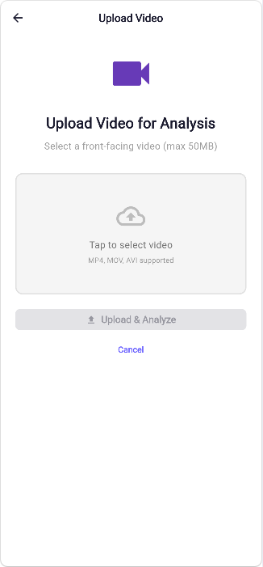
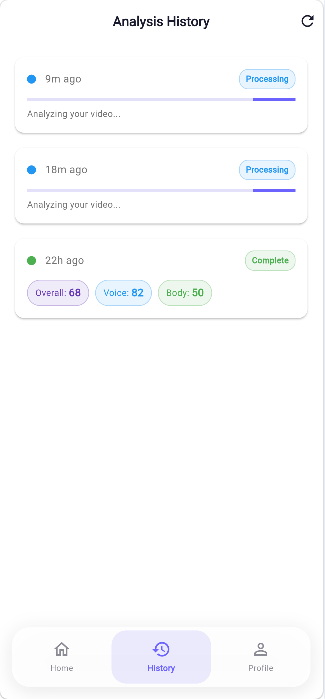
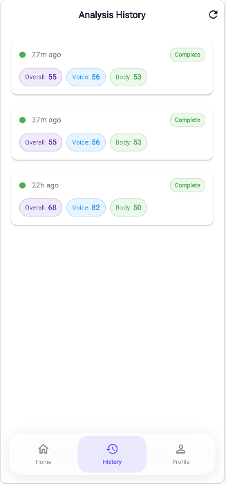
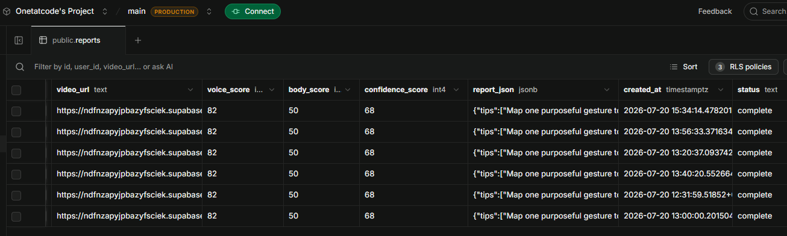
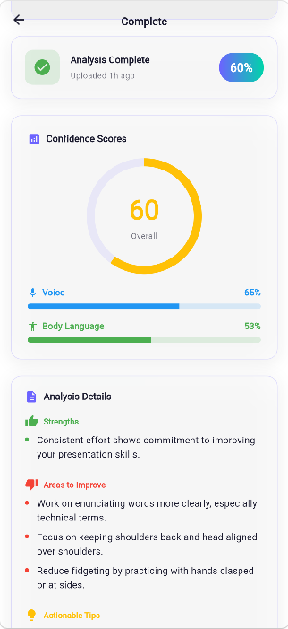
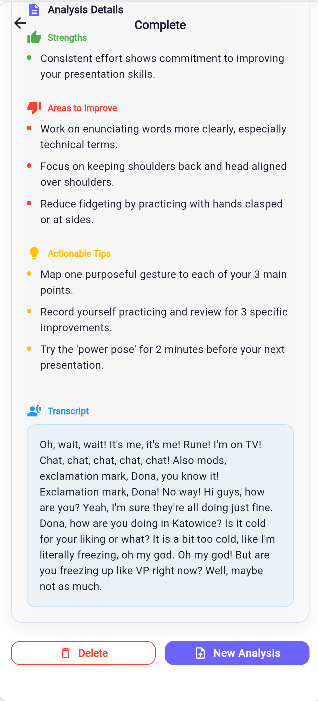

# Body Language and Voice Analyzer

A Flutter web app + Python FastAPI backend that analyzes uploaded videos for body language and voice patterns, generating confidence scores and actionable feedback reports.

**Try it**: Upload a front-facing video (max 50MB) → backend extracts audio + frames → transcribes speech (Groq Whisper), analyzes pace, pitch, filler words, pauses → detects 17 body keypoints (ONNX YOLOv8-pose), computes posture, gestures, eye contact → generates Voice Score, Body Score, Confidence Score → structured report with strengths, weaknesses, and tips.

---

## Architecture

```
┌─────────────────────┐     ┌──────────────────────────────────────────────────┐
│   Flutter Web App   │────▶│              Python FastAPI Backend               │
│  (body_language_    │     │  (app/)                                          │
│   analyzer/)        │     │                                                   │
│                     │     │  POST /api/v1/process                             │
│  - Auth (Supabase)  │     │  GET  /api/v1/process/{id}/status                  │
│  - Upload Video     │     │  POST /api/v1/process/sync                         │
│  - History          │     │  GET  /health                                    │
│  - Report Detail    │     │                                                   │
│  - Profile          │     │  Pipeline:                                        │
│                     │     │  1. Download video from Supabase Storage           │
│                     │     │  2. Extract audio (moviepy → ffmpeg)             │
│                     │     │  3. Transcribe (Groq Whisper-large-v3)           │
│                     │     │  4. Voice features (pydub + numpy FFT)           │
│                     │     │  5. Extract frames (moviepy, no cv2 needed)      │
│                     │     │  6. Body keypoints (ONNX YOLOv8n-pose, local)    │
│                     │     │  7. Calculate scores                              │
│                     │     │  8. Generate report (Groq Llama-3.1-8B)          │
│                     │     │  9. Save to Supabase                             │
│                     │     │  ───────────────────────────────────              │
│                     │     │  All analysis runs without native DLLs            │
│                     │     │  (ONNX Runtime + HTTP APIs only)                 │
└─────────────────────┘     └──────────────────────────────────────────────────┘
         │                              │
         └──────────┬───────────────────┘
                    │
         ┌──────────▼──────────┐
         │      Supabase       │
         │                     │
         │  - Auth (users)     │
         │  - Storage (videos) │
         │  - Database         │
         │    (reports table)  │
         └─────────────────────┘
```

## Features

### Voice Analysis
- **Speech Transcription** — Groq Whisper-large-v3 STT (87 words from 24s sample)
- **Speech Pace** — words per minute from transcribed speech (target: 110–160 WPM)
- **Pitch Variation** — numpy autocorrelation F0 estimation
- **Filler Word Count** — detected from transcript ("um", "uh", "like", etc.)
- **Pause Analysis** — frequency and duration of pauses via RMS energy
- **Voice Score** (0–100) — clarity, consistency, engagement sub-scores

### Body Language Analysis
- **17 COCO Keypoints** — nose, eyes, shoulders, elbows, wrists, hips, knees, ankles
- **Posture Stability** — head-shoulder-hip alignment score
- **Eye Contact Ratio** — percentage of time facing the camera
- **Gesture Frequency** — purposeful hand gestures per minute
- **Movement Frequency** — body movements per minute
- **Body Score** (0–100) — posture, stability, expressiveness sub-scores

### AI Report Generation
- **Top 3 strengths** with reference to actual data (pace, filler words, transcript quotes)
- **Top 3 weaknesses** tied to specific metrics
- **3 actionable tips** generated by Groq Llama-3.1-8B
- Template fallback when API is unavailable

### Flutter Web App
- **Auth** — Sign up, login, session persistence via Supabase
- **Upload** — File picker, upload to Supabase Storage, triggers processing
- **History** — List of past reports with score badges, status, timestamps
- **Report Detail** — Scores, transcript, strengths, weaknesses, tips
- **Profile** — User info, stats (total/completed/processing/failed), sign out
- **Glassmorphism UI** — Frosted glass design with light/dark theme
- **Bottom Nav** — Home / History / Profile tabs

## Screenshots

<div align="center">
  <table>
    <tr>
      <td></td>
      <td></td>
      <td></td>
    </tr>
    <tr>
      <td align="center"><b>Upload Page</b></td>
      <td align="center"><b>Processing Status</b></td>
      <td align="center"><b>History Page</b></td>
    </tr>
    <tr>
      <td></td>
      <td></td>
      <td></td>
    </tr>
    <tr>
      <td align="center"><b>Batch Analysis Complete</b></td>
      <td align="center"><b>Report Detail</b></td>
      <td align="center"><b>Transcript View</b></td>
    </tr>
  </table>
</div>

## Tech Stack

| Layer          | Technology                                                                 |
|----------------|---------------------------------------------------------------------------|
| Frontend       | Flutter 3.44, Dart, Provider, Supabase Flutter SDK                         |
| Backend        | Python 3.14, FastAPI, Uvicorn                                              |
| STT            | Groq API (Whisper-large-v3)                                                |
| Voice Analysis | pydub, NumPy (FFT autocorrelation, RMS energy)                             |
| Body Analysis  | ONNX Runtime, YOLOv8n-pose (17 COCO keypoints, local, no native DLLs)     |
| AI Reports     | Groq API (Llama-3.1-8B-Instruct) with template fallback                   |
| Database       | Supabase (PostgreSQL)                                                      |
| Storage        | Supabase Storage                                                           |
| Auth           | Supabase Auth (GoTrue)                                                     |

## Prerequisites

- Python 3.12+
- Flutter SDK 3.44+
- Chrome (for Flutter web)
- Supabase project (free tier works)
- Groq API key (free at https://console.groq.com/keys)

## Setup

### 1. Clone and Install Python Dependencies

```powershell
git clone https://github.com/Onetatcode/Video-Voice-Analyzer.git
cd "Body Language and Voice Analyzer"
pip install -r requirements.txt
```

This installs `onnxruntime` (for pose estimation), `pydub` (for audio), `moviepy` (for video), and `supabase` — no OpenCV, no MediaPipe, no TensorFlow.

### 2. Configure Supabase

Create a Supabase project at [supabase.com](https://supabase.com) and set up:

**Database — `reports` table:**

```sql
CREATE TABLE reports (
  id UUID DEFAULT gen_random_uuid() PRIMARY KEY,
  user_id UUID NOT NULL REFERENCES auth.users(id),
  video_url TEXT NOT NULL,
  status TEXT NOT NULL DEFAULT 'pending',
  voice_score INTEGER,
  body_score INTEGER,
  confidence_score INTEGER,
  report_json JSONB,
  error_message TEXT,
  created_at TIMESTAMPTZ DEFAULT now()
);

ALTER TABLE reports ENABLE ROW LEVEL SECURITY;

CREATE POLICY "Users can CRUD own reports"
  ON reports FOR ALL
  USING (auth.uid() = user_id);
```

**Storage — `videos` bucket:**

```sql
INSERT INTO storage.buckets (id, name, public) VALUES ('videos', 'videos', false);
```

### 3. Environment Variables

**`app/.env`:**
```env
SUPABASE_URL=https://your-project.supabase.co
SUPABASE_ANON_KEY=your-anon-key
SUPABASE_SERVICE_ROLE_KEY=your-service-role-key
BACKEND_URL=http://localhost:8000
GROQ_API_KEY=gsk_your_key_here
```

Get a free Groq API key at https://console.groq.com/keys.

**`body_language_analyzer/.env`:**
```env
SUPABASE_URL=https://your-project.supabase.co
SUPABASE_ANON_KEY=your-anon-key
BACKEND_URL=http://localhost:8000
```

### 4. Run

**Terminal 1 — Backend:**
```powershell
cd "Body Language and Voice Analyzer"
python -m uvicorn app.main:app --host 0.0.0.0 --port 8000
```

**Terminal 2 — Flutter Web (dev mode):**
```powershell
cd body_language_analyzer
flutter run -d chrome
```

**Or serve the pre-built app:**
```powershell
cd body_language_analyzer\build\web
python -m http.server 3000
# Open http://localhost:3000
```

## API Endpoints

| Method | Path                                | Description                        |
|--------|-------------------------------------|------------------------------------|
| GET    | `/health`                           | Health check                       |
| POST   | `/api/v1/process`                   | Start async video processing       |
| GET    | `/api/v1/process/{report_id}/status`| Check processing status            |
| POST   | `/api/v1/process/sync`              | Process video synchronously        |

### Process Request

```json
{
  "report_id": "uuid-from-database",
  "video_url": "https://supabase.co/storage/...",
  "user_id": "uuid-of-user"
}
```

### Process Response (Sync)

```json
{
  "report_id": "uuid",
  "status": "complete",
  "voice_features": {
    "speech_pace": 213.4,
    "pitch_variation": 703.85,
    "filler_word_count": 4,
    "pause_frequency": 14.7,
    "avg_pause_duration": 0.36,
    "total_duration": 24.46,
    "transcript": "Oh, wait, wait! It's me, it's me! Rune!..."
  },
  "body_features": {
    "posture_stability": 0.5,
    "eye_contact_ratio": 0.67,
    "gesture_frequency": 80.0,
    "movement_frequency": 210.0,
    "stability_score": 17.2,
    "expressiveness_score": 100.0
  },
  "scores": {
    "confidence_score": 65,
    "voice_score": 65,
    "body_score": 53
  },
  "analysis_report": {
    "level": "Good",
    "strengths": ["Your ability to engage with the audience is evident..."],
    "weaknesses": ["Your speaking pace is too fast, with 213.4 WPM..."],
    "tips": ["Practice speaking at a slower pace, aiming for 140-150 WPM..."]
  }
}
```

## Project Structure

```
├── app/                          # Python FastAPI Backend
│   ├── main.py                   # FastAPI app, CORS, route includes
│   ├── .env                      # Supabase + Groq credentials
│   ├── yolov8n-pose.onnx         # ONNX pose model (13.5 MB)
│   ├── models/
│   │   └── processing.py         # Pydantic models (request/response)
│   ├── routes/
│   │   └── processing.py         # API endpoints + background thread
│   └── services/
│       ├── video_processor.py    # Download, audio (pydub), frames (moviepy)
│       ├── voice_analyzer.py     # STT via Groq, filler detection, scoring
│       ├── body_analyzer.py      # ONNX YOLOv8-pose keypoint extraction
│       ├── score_calculator.py   # Voice/Body/Confidence scores
│       ├── processing_pipeline.py# Orchestrates full pipeline
│       └── report_generator.py   # Groq Llama AI + template fallback
│
├── body_language_analyzer/       # Flutter Web App
│   ├── lib/
│   │   ├── main.dart             # App entry, providers, routes
│   │   ├── models/report.dart    # Report data model
│   │   ├── screens/
│   │   │   ├── auth_gate.dart    # Auth state routing
│   │   │   ├── main_shell.dart   # Bottom nav shell
│   │   │   ├── home_screen.dart  # Welcome + upload button
│   │   │   ├── upload_screen.dart# File picker + upload
│   │   │   ├── history_screen.dart# Past reports list
│   │   │   ├── report_detail_screen.dart# Scores + transcript + tips
│   │   │   ├── profile_screen.dart# User info + stats
│   │   │   └── auth/
│   │   │       ├── login_screen.dart
│   │   │       └── sign_up_screen.dart
│   │   ├── services/
│   │   │   ├── api_service.dart   # Backend API calls
│   │   │   ├── auth_service.dart  # Supabase auth
│   │   │   ├── report_service.dart# Supabase reports CRUD
│   │   │   ├── storage_service.dart# Supabase file upload
│   │   │   └── supabase_service.dart# Supabase init
│   │   ├── theme/app_theme.dart   # Light/dark theme
│   │   └── widgets/glass_widgets.dart# Glassmorphism UI kit
│   └── .env                      # Flutter env vars
│
├── sample/                        # Sample video for testing
│   └── ohne.mp4
└── requirements.txt
```

## Current Limitations

- **Groq API required** — STT and AI report generation need a valid `GROQ_API_KEY` in `.env`. Without it, STT returns empty and reports use template fallback.
- **Windows WDAC restrictions** — On machines with Windows Defender Application Control, native DLLs (`cv2`, `librosa`) are blocked. The app uses pure-Python or ONNX Runtime alternatives, so no functionality is lost.
- **In-memory job tracking** — `processing_jobs` dict resets on server restart. Replace with Redis or Supabase-based job tracking for production.
- **Single-user testing** — Auth works but no admin panel or multi-tenant isolation beyond Supabase RLS.
- **Web-only** — Flutter app targets web. Mobile builds untested.

## License

MIT
